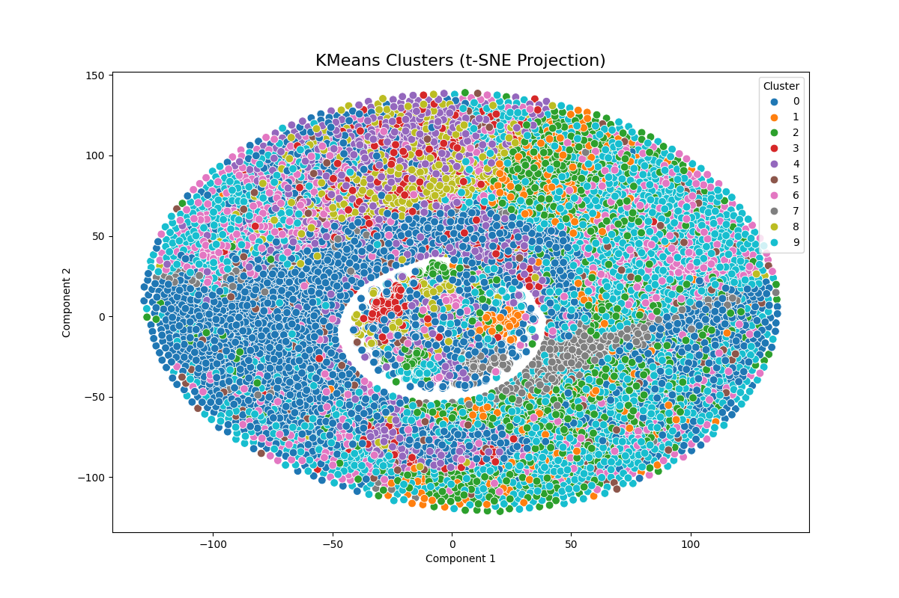
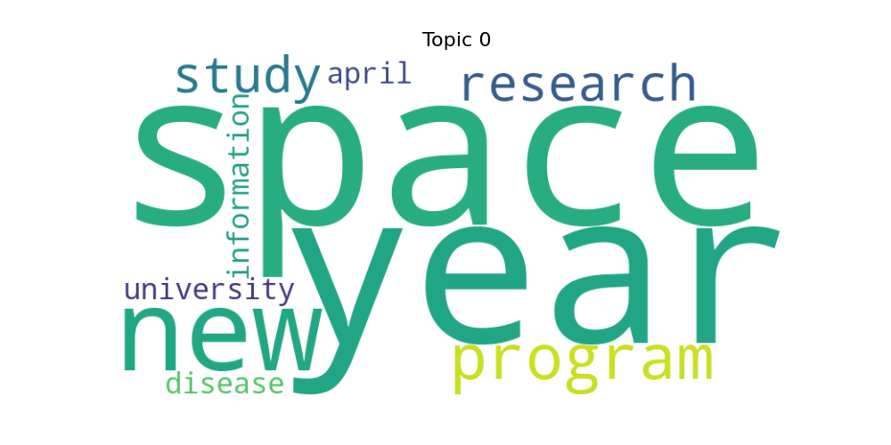

# 🧠 Topic Modeling using KMeans & LDA | 20 Newsgroups Dataset

This project demonstrates unsupervised topic modeling using **KMeans Clustering** and **Latent Dirichlet Allocation (LDA)** on the classic `20 Newsgroups` text corpus. It covers end-to-end preprocessing, modeling, and visualization.

---

## 📌 Objective

To group and understand similar documents across 20 news categories using clustering and topic extraction techniques, and visualize those insights.

---

## 🗃️ Dataset

- **Source:** [UCI ML Repository – 20 Newsgroups](http://archive.ics.uci.edu/ml/datasets/Twenty+Newsgroups)
- Contains 18K+ news articles across 20 categories.

---

## ⚙️ Tech Stack

| Layer             | Tools/Libs                                  |
|------------------|---------------------------------------------|
| Preprocessing     | NLTK, RegEx, Lemmatization, Stopword Removal |
| Feature Extraction| TF-IDF, CountVectorizer                     |
| Modeling          | KMeans (Clustering), LDA (Topic Modeling)   |
| Visualization     | t-SNE, WordCloud, Matplotlib, Seaborn       |

---

## 📊 Output Samples

### 🔹 KMeans Cluster Visualization:


### 🔹 WordCloud for Topics:
Example:



---

## 📁 Folder Structure

assignment-7-topic-modeling/
│
├── data/
│ └── raw/ # Original dataset
├── output/
│ ├── visualizations/ # Plots and WordClouds
│ ├── lda_topics.csv
│ ├── topics_summary.csv
│ └── cleaned_20newsgroups.csv
├── scripts/
│ ├── load_data.py
│ ├── preprocessing.py
│ ├── kmeans_model.py
│ ├── lda_model.py
│ └── visualization.py
├── notebooks/
│ └── topic_modeling.ipynb
├── README.md
├── requirements.txt
└── .gitignore


## 🙌 Contributions & Learnings

- Built an end-to-end **NLP Preprocessing Pipeline** (cleaning, lemmatization, vectorization)
- Applied **Unsupervised Machine Learning** for text clustering and topic discovery
- Compared **TF-IDF (KMeans)** vs **CountVectorizer (LDA)** performance and interpretability
- Created beautiful **data visualizations** using t-SNE and WordClouds for topic insights

---

## 🔖 Author

**Devpratap R. Singh**  
🎓 Data Science | AIML | Strategy  
[🔗 LinkedIn](https://www.linkedin.com/in/devpratap-r-singh-0b00011b3/) • [💻 GitHub](https://github.com/devpratap)


---

## 🚀 How To Run

```bash
# Clone the repo
git clone https://github.com/yourusername/assignment-7-topic-modeling.git

# Install requirements
pip install -r requirements.txt

# Run the notebook
cd notebooks
jupyter notebook topic_modeling.ipynb


---

### ✅ 2. Create `.gitignore`

```bash
__pycache__/
.ipynb_checkpoints/
*.csv
*.png
venv/


